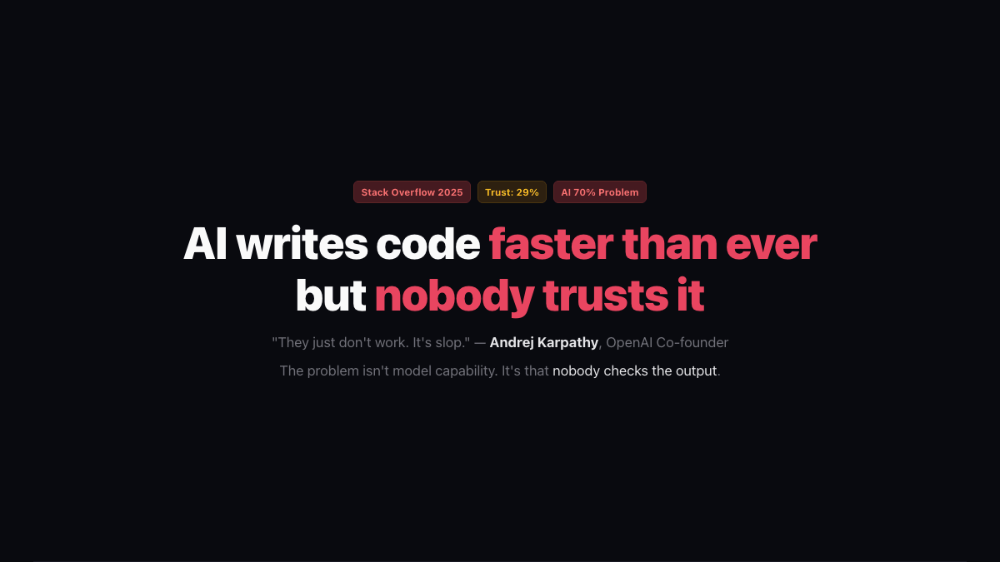

**English** | [中文](README.md)

# Orchestrator v2.0 · Worker-Checker Couple

> AI Quality Assurance System 2.0. Upgrades v1's "one Worker does everything" to "multiple Worker-Checker Couples working in parallel."
> File-based handoffs between Workers. loop.py as pure-code scheduler. Three-layer anti-cheat.

> "They just don't work. It's slop." — **Andrej Karpathy**, OpenAI co-founder.
>
> "AI gets you 70% of the way. The last 30% is just as hard." — **Addy Osmani**, Google Chrome Engineering Director.

**The problem isn't model capability. It's that nobody checks the output.**



## v2.0 vs v1.0

| Dimension | v1.0 | v2.0 |
|-----------|------|------|
| Worker granularity | One Worker for everything | Multiple minimal Couples |
| Scheduling | Orch schedules directly | loop.py generates instructions → Orch executes mechanically |
| Task decomposition | Orch decomposes | PM Couple decomposes |
| Parallelism | Not supported | Same-layer Couples run in parallel |
| File handoff | Not required | Enforced file-path handoff |
| Orch permissions | Full access | Only translate + relay + present |
| Anti-cheat | Basic | Three-layer defense (narrative + structural + verification) |
| Multi-platform | Claude Code only | CodeBuddy / Claude Code / Codex CLI / Generic |

## Core Philosophy

> One Worker does one kind of thing, uses one capability, communicates only via files.

```
User → Orch (Messenger) → loop.py (Architect) → Parallel Couples
                                                   ├── Couple A: Prod Worker → Check Worker → judge.py
                                                   ├── Couple B: Prod Worker → Check Worker → judge.py
                                                   └── Couple C: Prod Worker → Check Worker → judge.py
```

**The Messenger's Compact**: Orch is not "restricted" — it has willingly accepted a contract. Cannot create. Cannot judge. Cannot plan. Only deliver.

## Multi-Platform Support

The skill auto-detects your platform on load:

| Platform | Status |
|----------|--------|
| CodeBuddy | ✅ Ready |
| Claude Code | ✅ Ready |
| OpenAI Codex CLI | ✅ Ready |
| Other / Unknown | 🌱 Self-growing (Orch probes tools and maps dynamically) |

## Quick Start

**1. Install**

Give the GitHub link to your AI coding assistant:

```
Install this skill: https://github.com/Gavin9902/orchestrator-ai
```

**2. Summon**

```
/orch-worker-couple
```

Or trigger words: `couple`, `worker-couple`, `parallel Worker`

**3. Talk through requirements**

Orch guides you through clarifying what needs to be done. PM Couple auto-decomposes the task graph.

**4. Wait**

loop.py schedules parallel Couples. Check progress anytime.

**5. Approve**

All Couples pass judge.py review → Orch presents results. Nothing is delivered until you confirm.

## Architecture Docs

| Doc | Content |
|-----|---------|
| `core/ARCHITECTURE.md` | Role model, anti-cheat system, Worker splitting principles |
| `core/PROTOCOLS.md` | Data formats, Action types, state machine, loop.py interface |
| `codebuddy/SKILL.md` | CodeBuddy platform-specific version |
| `claude-code/SKILL.md` | Claude Code platform-specific version |
| `codex/SKILL.md` | Codex CLI platform-specific version |
| `generic/SKILL.md` | Generic version (self-growing) |

## Three-Layer Anti-Cheat

```
🪄 Layer 1 · Narrative — Messenger's Compact + Five Breaths + Urge Protocol
🔒 Layer 2 · Structural — File handoff + Context isolation + Mutual unawareness
🔐 Layer 3 · Verification — action_hash + orch_receipt + checksum + .lock
```

Covers 20 cheat paths. See `core/ARCHITECTURE.md` for details.

## v1.0 Archive

v1.0 (original orchestrator) is preserved in the `v1/` directory and remains usable.

## License

MIT
