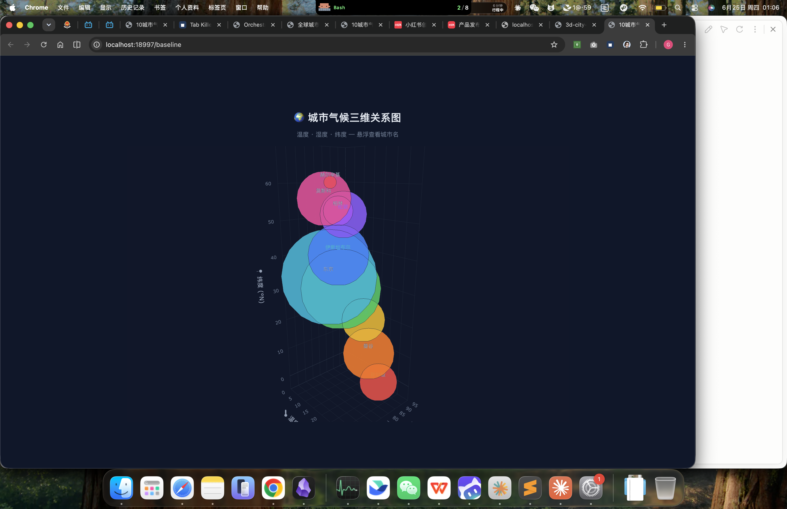

# City Climate 3D Chart — 第一次对比

> 同一 prompt · 两种生成路径 · 2026-06-25

## 测试说明

**Prompt**: 生成一个 3 维度图，展示 10 个城市的温度、湿度、纬度。

| 版本 | 生成方式 | 生产耗时 | 文件 |
|------|---------|---------|------|
| **Baseline** | 直接在 Claude Code 对话中给 prompt 生成 | ~15s | [`baseline.html`](./baseline.html) |
| **Orch Worker-Couple** | 经过 orch-worker-couple 架构：信使翻译 spec → 工匠 Worker 独立生成 → 信使展示 | ~30s | [`orch-output.html`](./orch-output.html) |

## 视觉效果对比

| 维度 | Baseline | Orch Worker-Couple |
|------|----------|-------------------|
| **坐标轴分配** | X=温度, Y=湿度, Z=纬度 | X=纬度, Y=温度, Z=湿度 |
| **城市选择** | 新加坡、曼谷、香港、上海、东京、伊斯坦布尔、伦敦、柏林、莫斯科、赫尔辛基（东亚/欧为主） | 新加坡、东京、伦敦、开罗、悉尼、雷克雅未克、孟买、莫斯科、内罗毕、曼谷（全球均衡） |
| **气泡颜色** | 固定色板（手动赋值） | 温度渐变映射（蓝→红） |
| **气泡大小** | 按人口 sqrt×2.2 | 按人口 sqrt×10 |
| **色条图例** | 无 | 温度色条 |
| **tooltip** | 温度/湿度/纬度 | 完整的城市名＋温度/湿度/纬度/人口 |
| **城市标签** | 中文名 | 英文名 |
| **工具栏** | 隐藏（简洁） | 显示（可截图、缩放） |
| **背景** | 纯色深色 `#0f172a` | 渐变深色 + 毛玻璃卡片效果 |

## 截图

| Baseline | Orch Worker-Couple |
|----------|-------------------|
|  |  |

## 关键差异分析

1. **坐标轴映射不同** — 相同的 prompt，两个 LLM 对"3 维度图"的轴分配理解不同
2. **城市覆盖不同** — Baseline 偏东亚/欧洲，Orch 版本覆盖全球六大洲，数据更多样
3. **视觉风格差异** — Baseline 简洁克制，Orch 版本功能完整（色条、tooltip 完整信息、截图按钮）
4. **数据标注方式** — Baseline 直接标注中文城市名在图上，Orch 版本依赖悬浮 tooltip 显示

## 原始 prompt

```
生成一个 3 维度图，展示 10 个城市的温度、湿度、纬度。
```
